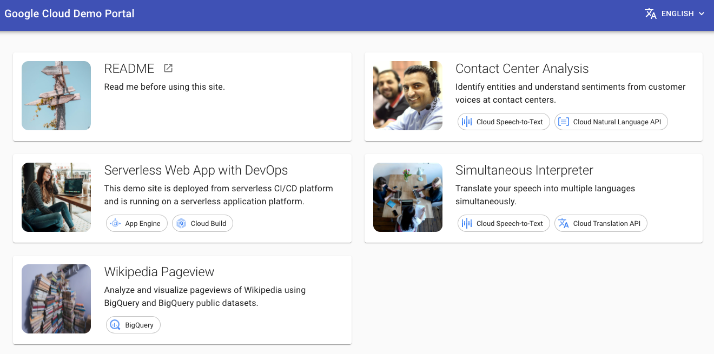

# Cloud Demo Portal

Cloud Demo Portal is an App Engine web application which has small demos.

**Cloud Demo Portal is not an official Google Cloud project.**



## Deploy

### Prerequisites

- An empty Google Cloud project
- [Google Cloud SDK (gcloud)](https://cloud.google.com/sdk/docs/install)
- Terraform

### Clone this repository

```bash
git clone https://github.com/GoogleCloudPlatform/appengine-cloud-demo-portal.git
cd appengine-cloud-demo-portal
```

### Apply Terraform

Make your `.envrc`.

```bash
cd terraform
cp .envrc.example .envrc
vi .envrc
source .envrc
```

Initialize terraform.

```bash
terraform init
```

Apply terraform.

```bash
terraform apply
```

### Push source code and deploy app

Push source code and then Cloud Build triggers to deploy app are triggered automatically.

```bash
cd ..
git config --global credential.https://source.developers.google.com.helper gcloud.sh
git remote add google https://source.developers.google.com/p/${TF_VAR_project_id}/r/cloud-demos
git push google main
```

First builds for triggers named api and dispatch might fail because deploying them needs web (default) service to be deployed.
After the build named web is finished, run api trigger manually. And after api is deployed, then run dispatch trigger manually.

You can run them on [Console](https://console.cloud.google.com/cloud-build/builds).

If authentication doesn't work, you can enable IAP on [Console](https://console.cloud.google.com/security/iap).


## Development

Prerequisites

- [direnv](https://direnv.net/)
- [Docker](https://docs.docker.com/get-docker/)
- [Docker Compose](https://docs.docker.com/compose/)

Setup git hooks.

```bash
scripts/init-git-hooks
```

Create application-default credentials.

```bash
gcloud auth application-default login
```

Create your `.envrc` and change `PROJECT_ID` to yours.

```bash
cp .envrc.example .envrc
vi .envrc
```

Run development servers.

```bash
docker-compose up

# on macOS
docker-compose -f docker-compose.macos.yaml up
```

Go to [http://localhost:8080](http://localhost:8080).